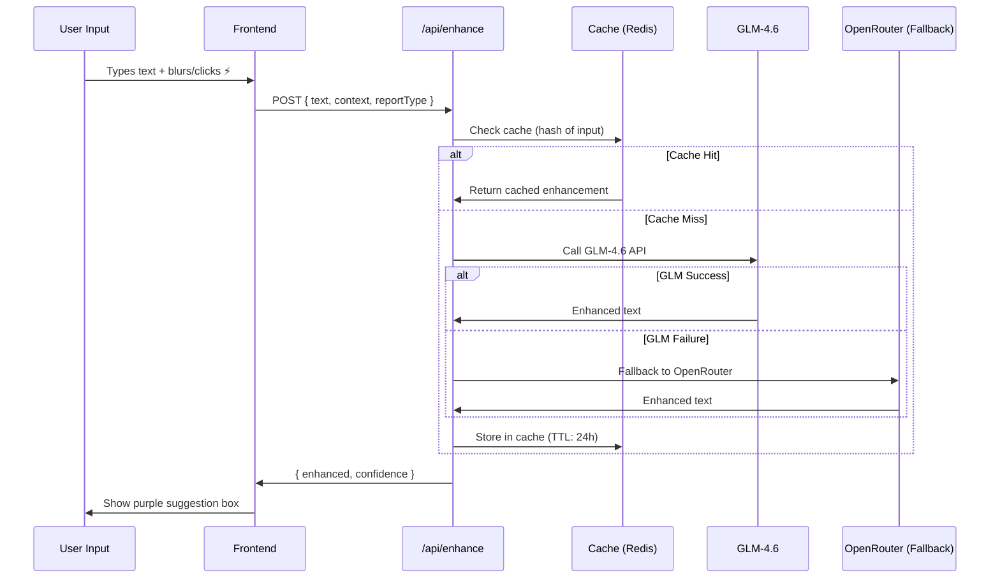

# Architecture Decision Document - ReportCreator

**Architect:** Winston (System Architect)  
**Date:** 2025-12-04  
**Version:** 1.0

---

## Executive Summary

ReportCreator is an AI-enhanced Arabic educational report generator built on **Next.js 14** with **MongoDB** for persistence and **GLM-4.6** for intelligent content enhancement. The architecture prioritizes:

1. **Speed** - Sub-3-minute report completion
2. **Arabic-First** - RTL design from the ground up
3. **AI Integration** - Real-time content enhancement
4. **Privacy** - Self-hosted Docker deployment

---

## 1. System Overview

### High-Level Architecture

```
┌─────────────────────────────────────────────────────────────────┐
│                         CLIENT LAYER                            │
│  ┌─────────────────────────────────────────────────────────┐   │
│  │                   Next.js 14 Frontend                    │   │
│  │  ┌──────────┐ ┌──────────┐ ┌──────────┐ ┌──────────┐   │   │
│  │  │ Landing  │ │ Type     │ │ Wizard   │ │ Preview  │   │   │
│  │  │ Page     │ │ Selector │ │ (6 Steps)│ │ & Edit   │   │   │
│  │  └──────────┘ └──────────┘ └──────────┘ └──────────┘   │   │
│  └─────────────────────────────────────────────────────────┘   │
├─────────────────────────────────────────────────────────────────┤
│                         API LAYER                               │
│  ┌─────────────────────────────────────────────────────────┐   │
│  │                 Next.js API Routes                       │   │
│  │  /api/reports    /api/enhance    /api/export    /api/auth│   │
│  └─────────────────────────────────────────────────────────┘   │
├─────────────────────────────────────────────────────────────────┤
│                      SERVICE LAYER                              │
│  ┌──────────────┐ ┌──────────────┐ ┌──────────────┐           │
│  │ Report       │ │ AI           │ │ PDF          │           │
│  │ Service      │ │ Enhancement  │ │ Generator    │           │
│  └──────────────┘ └──────────────┘ └──────────────┘           │
├─────────────────────────────────────────────────────────────────┤
│                      DATA LAYER                                 │
│  ┌──────────────┐ ┌──────────────┐ ┌──────────────┐           │
│  │ MongoDB      │ │ File Storage │ │ GLM-4.6 API  │           │
│  │ (Reports)    │ │ (Uploads)    │ │ (AI)         │           │
│  └──────────────┘ └──────────────┘ └──────────────┘           │
└─────────────────────────────────────────────────────────────────┘
```

---

## 2. Technology Stack Decisions

### Frontend

| Component | Technology | Rationale |
|-----------|------------|-----------|
| **Framework** | Next.js 14 (App Router) | Server components, streaming, excellent DX |
| **Styling** | Tailwind CSS + RTL plugin | Utility-first, easy RTL support |
| **Forms** | React Hook Form + Zod | Type-safe validation, performance |
| **State** | Zustand | Simple, lightweight, wizard state |
| **UI Components** | shadcn/ui | Accessible, customizable, RTL-ready |

### Backend

| Component | Technology | Rationale |
|-----------|------------|-----------|
| **API** | Next.js Route Handlers | Co-located, type-safe, streaming |
| **Database** | MongoDB | Flexible schemas for report types |
| **Auth** | NextAuth.js | Simple, extensible, session-based |
| **File Upload** | Local filesystem | Self-hosted requirement |
| **PDF Generation** | Puppeteer | HTML-to-PDF, Arabic font embedding |

### AI Integration

| Component | Technology | Rationale |
|-----------|------------|-----------|
| **Primary LLM** | GLM-4.6 (Direct API) | Cost-effective, Arabic capability |
| **Fallback** | OpenRouter | Multiple model access |
| **Caching** | Redis (optional) | Cache common enhancements |

### Deployment

| Component | Technology | Rationale |
|-----------|------------|-----------|
| **Containerization** | Docker Compose | Self-hosted requirement |
| **Web Server** | Nginx (reverse proxy) | SSL termination, caching |
| **Process Manager** | PM2 (inside container) | Auto-restart, logging |

---

## 3. Directory Structure

```
reportcreator/
├── app/                          # Next.js App Router
│   ├── (marketing)/              # Landing page route group
│   │   └── page.tsx              # Landing page
│   ├── (app)/                    # Application routes
│   │   ├── layout.tsx            # App layout with RTL
│   │   ├── select/               # Report type selection
│   │   │   └── page.tsx
│   │   ├── create/               # Multi-step wizard
│   │   │   ├── [reportType]/
│   │   │   │   └── page.tsx      # Dynamic route per type
│   │   │   └── layout.tsx        # Wizard layout
│   │   ├── preview/              # Preview & edit
│   │   │   └── [reportId]/
│   │   │       └── page.tsx
│   │   └── export/               # Export success
│   │       └── [reportId]/
│   │           └── page.tsx
│   ├── api/                      # API Route Handlers
│   │   ├── reports/
│   │   │   ├── route.ts          # CRUD operations
│   │   │   └── [id]/route.ts     # Single report ops
│   │   ├── enhance/
│   │   │   └── route.ts          # AI enhancement endpoint
│   │   ├── export/
│   │   │   ├── pdf/route.ts      # PDF generation
│   │   │   └── share/route.ts    # Share links
│   │   └── upload/
│   │       └── route.ts          # Image uploads
│   └── globals.css               # Global styles + RTL
├── components/
│   ├── ui/                       # shadcn/ui components
│   ├── wizard/                   # Wizard step components
│   │   ├── WizardLayout.tsx
│   │   ├── ProgressBar.tsx
│   │   ├── StepOrganization.tsx
│   │   ├── StepActivity.tsx
│   │   ├── StepObjectives.tsx
│   │   ├── StepResults.tsx
│   │   ├── StepRecommendations.tsx
│   │   └── StepMedia.tsx
│   ├── ai/                       # AI enhancement components
│   │   ├── AIEnhanceButton.tsx
│   │   ├── AISuggestionBox.tsx
│   │   └── AIBadge.tsx
│   ├── preview/                  # Preview components
│   │   ├── ReportPreview.tsx
│   │   ├── InlineEditor.tsx
│   │   └── ImageGrid.tsx
│   └── shared/                   # Shared components
│       ├── Header.tsx
│       ├── Footer.tsx
│       └── RTLProvider.tsx
├── lib/
│   ├── db/                       # Database utilities
│   │   ├── mongodb.ts            # Connection singleton
│   │   └── models/
│   │       ├── Report.ts         # Report model
│   │       └── User.ts           # User model
│   ├── ai/                       # AI service
│   │   ├── enhance.ts            # Enhancement logic
│   │   ├── prompts.ts            # Prompt templates
│   │   └── client.ts             # API client
│   ├── pdf/                      # PDF generation
│   │   ├── generator.ts          # HTML-to-PDF
│   │   └── templates/            # Report templates
│   │       ├── activity.html
│   │       ├── program.html
│   │       └── general.html
│   ├── schemas/                  # Zod schemas
│   │   ├── report.ts             # Report validation
│   │   └── wizard.ts             # Wizard form schemas
│   └── utils/
│       ├── rtl.ts                # RTL utilities
│       └── arabic.ts             # Arabic text helpers
├── hooks/                        # Custom React hooks
│   ├── useWizard.ts              # Wizard state management
│   ├── useAIEnhance.ts           # AI enhancement hook
│   └── useReport.ts              # Report CRUD hook
├── config/
│   ├── report-types.ts           # Report type definitions
│   └── ai.ts                     # AI configuration
├── public/
│   ├── fonts/                    # Cairo, Tajawal fonts
│   ├── logos/                    # Ministry, default school
│   └── templates/                # PDF template assets
├── docker/
│   ├── Dockerfile                # Next.js container
│   ├── docker-compose.yml        # Full stack
│   └── nginx.conf                # Reverse proxy config
├── .env.example                  # Environment template
├── package.json
├── tailwind.config.js            # Tailwind + RTL
└── next.config.js                # Next.js config
```

---

## 4. Data Models

### Report Schema

```typescript
// lib/db/models/Report.ts
interface Report {
  _id: ObjectId;
  
  // Metadata
  type: 'activity' | 'program' | 'discipline' | 'admin' | 'general';
  status: 'draft' | 'completed';
  createdAt: Date;
  updatedAt: Date;
  userId?: ObjectId;
  
  // Organization
  organization: {
    schoolName: string;
    department?: string;
    logoUrl?: string;
  };
  
  // Content (varies by type)
  content: {
    title: string;
    date: Date;
    targetAudience: string[];
    participantsCount: number;
    location?: string;
    
    // AI-enhanced fields
    objectives: EnhancedText[];
    results: EnhancedText[];
    recommendations?: EnhancedText[];
    
    // Program-specific
    programType?: 'workshop' | 'training' | 'initiative';
    duration?: string;
    trainerName?: string;
    topicsCovered?: string[];
  };
  
  // Media
  media: {
    photos: UploadedImage[];
  };
  
  // Signatures (optional)
  signatures?: {
    executorName?: string;
    supervisorName?: string;
  };
  
  // PDF output
  pdfUrl?: string;
}

interface EnhancedText {
  original: string;
  enhanced: string;
  isAIEnhanced: boolean;
  acceptedAt?: Date;
}

interface UploadedImage {
  url: string;
  order: number;
  caption?: string;
}
```

### Wizard State Schema

```typescript
// lib/schemas/wizard.ts
interface WizardState {
  currentStep: number;
  totalSteps: number;
  reportType: ReportType;
  data: Partial<ReportFormData>;
  isDirty: boolean;
  startedAt: Date;
}
```

---

## 5. API Endpoints

### Report CRUD

```
POST   /api/reports              Create new report (draft)
GET    /api/reports              List user's reports
GET    /api/reports/:id          Get single report
PUT    /api/reports/:id          Update report
DELETE /api/reports/:id          Delete report
```

### AI Enhancement

```
POST   /api/enhance
Body:  { text: string, context: 'objectives' | 'results' | 'recommendations', reportType: string }
Response: { enhanced: string, confidence: number }
```

### Export

```
POST   /api/export/pdf/:reportId
Response: { pdfUrl: string }

POST   /api/export/share/:reportId
Body:  { channel: 'whatsapp' | 'email' }
Response: { shareUrl: string }
```

### Upload

```
POST   /api/upload
Body:  FormData with image file
Response: { url: string, thumbnailUrl: string }
```

---

## 6. AI Enhancement Architecture

### Enhancement Flow



### Prompt Template

```typescript
// lib/ai/prompts.ts
const ENHANCEMENT_PROMPT = `
أنت كاتب تقارير تربوية محترف متخصص في صياغة التقارير الرسمية لوزارة التعليم السعودية.

المهمة: حسّن النص التالي ليكون بصياغة رسمية احترافية مناسبة للتقارير التعليمية.

السياق: {{context}}
نوع التقرير: {{reportType}}
النص الأصلي: {{userInput}}

المتطلبات:
1. حافظ على المعنى الأصلي
2. استخدم مصطلحات تربوية رسمية
3. اجعل الجملة كاملة ومترابطة
4. لا تضف معلومات غير موجودة في الأصل

النص المحسّن:
`;
```

### Configuration

```typescript
// config/ai.ts
export const AI_CONFIG = {
  glm: {
    apiKey: process.env.GLM_API_KEY,
    model: 'glm-4.6',
    maxTokens: 200,
    temperature: 0.7,
  },
  openRouter: {
    apiKey: process.env.OPENROUTER_API_KEY,
    model: 'anthropic/claude-3-haiku',
  },
  cache: {
    ttl: 86400, // 24 hours
    prefix: 'enhance:',
  },
};
```

---

## 7. PDF Generation Architecture

### Generation Flow

```
1. User clicks "Download PDF"
2. Frontend calls POST /api/export/pdf/:reportId
3. Server fetches Report from MongoDB
4. Server renders HTML template with data
5. Puppeteer converts HTML to PDF
   - Embeds Cairo/Tajawal fonts
   - Sets RTL direction
   - Applies A4 formatting
6. PDF saved to /uploads/pdfs/:reportId.pdf
7. Response returns signed URL
8. Frontend triggers download
```

### Template System

```html
<!-- lib/pdf/templates/activity.html -->
<!DOCTYPE html>
<html dir="rtl" lang="ar">
<head>
  <style>
    @font-face {
      font-family: 'Cairo';
      src: url('./fonts/Cairo-Regular.woff2') format('woff2');
    }
    body {
      font-family: 'Cairo', sans-serif;
      direction: rtl;
      padding: 20mm;
    }
    .header { /* Ministry branding */ }
    .content { /* Report sections */ }
    .photos { /* Image grid */ }
    .footer { /* Signatures */ }
  </style>
</head>
<body>
  <header class="header">
    
    <h1>{{schoolName}}</h1>
  </header>
  <main class="content">
    <h2>{{title}}</h2>
    <section class="objectives">
      {{#each objectives}}
        <p>• {{this.enhanced}}</p>
      {{/each}}
    </section>
    <!-- ... -->
  </main>
</body>
</html>
```

---

## 8. State Management

### Zustand Wizard Store

```typescript
// hooks/useWizard.ts
import { create } from 'zustand';
import { persist } from 'zustand/middleware';

interface WizardStore {
  // State
  currentStep: number;
  reportType: ReportType | null;
  formData: Partial<ReportFormData>;
  
  // Actions
  setReportType: (type: ReportType) => void;
  setStep: (step: number) => void;
  updateFormData: (data: Partial<ReportFormData>) => void;
  nextStep: () => void;
  prevStep: () => void;
  reset: () => void;
}

export const useWizard = create<WizardStore>()(
  persist(
    (set, get) => ({
      currentStep: 1,
      reportType: null,
      formData: {},
      
      setReportType: (type) => set({ reportType: type }),
      setStep: (step) => set({ currentStep: step }),
      updateFormData: (data) => set({ 
        formData: { ...get().formData, ...data } 
      }),
      nextStep: () => set({ currentStep: get().currentStep + 1 }),
      prevStep: () => set({ currentStep: get().currentStep - 1 }),
      reset: () => set({ currentStep: 1, reportType: null, formData: {} }),
    }),
    { name: 'wizard-storage' }
  )
);
```

---

## 9. Docker Deployment

### docker-compose.yml

```yaml
version: '3.8'

services:
  web:
    build: .
    ports:
      - "3000:3000"
    environment:
      - MONGODB_URI=mongodb://mongo:27017/reportcreator
      - GLM_API_KEY=${GLM_API_KEY}
      - NEXTAUTH_SECRET=${NEXTAUTH_SECRET}
    volumes:
      - ./uploads:/app/uploads
    depends_on:
      - mongo
    restart: unless-stopped

  mongo:
    image: mongo:7
    ports:
      - "27017:27017"
    volumes:
      - mongo_data:/data/db
    restart: unless-stopped

  nginx:
    image: nginx:alpine
    ports:
      - "80:80"
      - "443:443"
    volumes:
      - ./docker/nginx.conf:/etc/nginx/nginx.conf
      - ./certs:/etc/nginx/certs
    depends_on:
      - web
    restart: unless-stopped

volumes:
  mongo_data:
```

### Dockerfile

```dockerfile
FROM node:20-alpine AS base

# Install Puppeteer dependencies
RUN apk add --no-cache \
    chromium \
    nss \
    freetype \
    harfbuzz \
    ca-certificates \
    ttf-freefont

ENV PUPPETEER_EXECUTABLE_PATH=/usr/bin/chromium-browser

FROM base AS deps
WORKDIR /app
COPY package*.json ./
RUN npm ci

FROM base AS builder
WORKDIR /app
COPY --from=deps /app/node_modules ./node_modules
COPY . .
RUN npm run build

FROM base AS runner
WORKDIR /app
ENV NODE_ENV=production

COPY --from=builder /app/public ./public
COPY --from=builder /app/.next/standalone ./
COPY --from=builder /app/.next/static ./.next/static

EXPOSE 3000
CMD ["node", "server.js"]
```

---

## 10. Security Considerations

| Area | Measure |
|------|---------|
| **Authentication** | NextAuth with secure session cookies |
| **API Protection** | Rate limiting on /api/enhance (5 req/min) |
| **File Upload** | Image type validation, size limits (5MB) |
| **XSS Prevention** | Content Security Policy headers |
| **CORS** | Strict origin policy |
| **Environment** | Secrets via Docker secrets/env vars |

---

## 11. Performance Optimizations

| Optimization | Implementation |
|--------------|----------------|
| **AI Caching** | Redis cache for common enhancements |
| **Image Optimization** | Next.js Image component, WebP |
| **PDF Caching** | Store generated PDFs, invalidate on edit |
| **Bundle Size** | Dynamic imports for wizard steps |
| **Font Loading** | Font preloading, subset Arabic glyphs |

---

## 12. Implementation Priority

### Phase 1 (MVP) - 3-5 Days

1. ✅ Project setup (Next.js, Tailwind, MongoDB)
2. ✅ Landing page
3. ✅ Report type selection
4. ✅ Multi-step wizard (6 steps)
5. ✅ AI enhancement integration
6. ✅ Basic preview
7. ✅ PDF export

### Phase 2 (v1.1) - 1 Week

1. 🔄 Inline preview editing
2. 🔄 WhatsApp/Email sharing
3. 🔄 User authentication
4. 🔄 Report history

### Phase 3 (v1.2) - 1 Week

1. ⏳ Template saving
2. ⏳ Report cloning
3. ⏳ Additional report types
4. ⏳ Admin dashboard

---

## 13. Environment Variables

```bash
# .env.example

# Database
MONGODB_URI=mongodb://localhost:27017/reportcreator

# AI
GLM_API_KEY=your_glm_api_key
OPENROUTER_API_KEY=your_openrouter_key

# Auth
NEXTAUTH_SECRET=your_nextauth_secret
NEXTAUTH_URL=http://localhost:3000

# Storage
UPLOAD_DIR=./uploads

# Optional: Redis for caching
REDIS_URL=redis://localhost:6379
```

---

*Document Version: 1.0*  
*Architect: Winston (System Architect)*  
*Last Updated: 2025-12-04*
