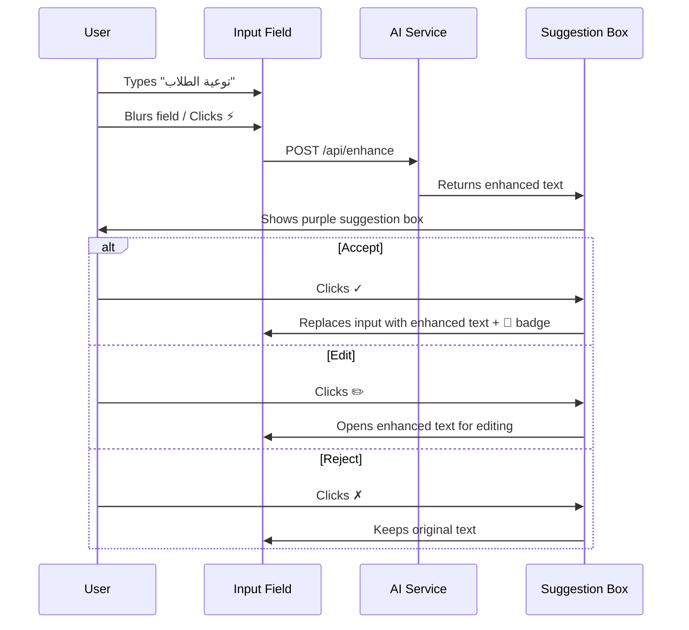

# UX Design Specification - ReportCreator

**Author:** Sally (UX Designer) for Chairi  
**Date:** 2025-12-04  
**Version:** 1.0

---

## Executive Summary

ReportCreator transforms how Arabic educators create professional reports through an **AI-enhanced, guided wizard experience**. This UX specification defines the complete user interface for a 6-stage journey optimized for Arabic RTL layouts.

### Design Philosophy

| Principle | Application |
|-----------|-------------|
| **Speed First** | Complete report in under 3 minutes |
| **Guided Experience** | Multi-step wizard reduces cognitive load |
| **AI-Assisted** | Real-time content enhancement builds confidence |
| **Mobile-Ready** | Responsive design for tablets in classrooms |
| **Arabic-Native** | RTL-first design, not adapted from LTR |

---

## Design System

### Color Palette

```
Primary:     #1B4D3E (Deep Green - Saudi education theme)
Secondary:   #2E7D32 (Ministry Green)
Accent:      #FFB300 (Golden - highlight & CTAs)
Background:  #F5F7FA (Light gray)
Surface:     #FFFFFF (White cards)
Text:        #1A1A2E (Near black)
Text Muted:  #6B7280 (Gray)
Success:     #10B981 (Green)
Error:       #EF4444 (Red)
AI Accent:   #8B5CF6 (Purple - AI enhanced content)
```

### Typography

```
Arabic Primary:   'Cairo', sans-serif (Google Fonts)
Arabic Secondary: 'Tajawal', sans-serif
Latin Fallback:   'Inter', sans-serif

Headings:   Cairo Bold
Body:       Cairo Regular
Labels:     Cairo Medium
AI Content: Cairo Medium + AI Badge
```

### Spacing Scale (RTL-aware)

```
xs: 4px   | sm: 8px   | md: 16px
lg: 24px  | xl: 32px  | 2xl: 48px
```

### Component Standards

| Component | Height | Radius | Shadow |
|-----------|--------|--------|--------|
| Button Primary | 48px | 8px | sm |
| Button Secondary | 40px | 6px | none |
| Input Field | 48px | 8px | inner |
| Card | auto | 12px | md |
| Modal | auto | 16px | lg |

---

## Screen Specifications

### Screen 1: Landing Page (الصفحة الرئيسية)

**Purpose:** Convert visitors to users with compelling value proposition

```
┌─────────────────────────────────────────────────────────────┐
│  [Logo]                                    [تسجيل الدخول]  │
├─────────────────────────────────────────────────────────────┤
│                                                             │
│              ┌─────────────────────────────┐                │
│              │     حوّل بيانات فعاليتك     │                │
│              │   إلى تقرير احترافي خلال    │                │
│              │          ثوانٍ ⚡           │                │
│              └─────────────────────────────┘                │
│                                                             │
│                    [Illustration: Teacher                   │
│                     with document + AI sparkles]            │
│                                                             │
│              ┌─────────────────────────────┐                │
│              │       🟢 ابدأ الآن         │ ← Primary CTA   │
│              └─────────────────────────────┘                │
│                                                             │
│    ✓ تقارير رسمية      ✓ صياغة ذكية     ✓ تحميل PDF       │
│                                                             │
├─────────────────────────────────────────────────────────────┤
│  [Feature Cards Row]                                        │
│  ┌──────────┐  ┌──────────┐  ┌──────────┐  ┌──────────┐    │
│  │ 📝       │  │ 🤖       │  │ 👁️       │  │ 📄       │    │
│  │ إدخال    │  │ صياغة    │  │ معاينة   │  │ تحميل    │    │
│  │ سريع     │  │ ذكية     │  │ فورية    │  │ PDF      │    │
│  └──────────┘  └──────────┘  └──────────┘  └──────────┘    │
├─────────────────────────────────────────────────────────────┤
│  Footer: [عن التطبيق] [سياسة الخصوصية] [تواصل معنا]       │
└─────────────────────────────────────────────────────────────┘
```

**Responsive Behavior:**
- Mobile: Stack feature cards 2x2
- Tablet: Horizontal scroll for features
- Desktop: Full row layout

---

### Screen 2: Report Type Selection (اختيار نوع التقرير)

**Purpose:** Route users to type-specific form with dynamic fields

```
┌─────────────────────────────────────────────────────────────┐
│  ← الرئيسية                          [شعار المدرسة صغير]  │
├─────────────────────────────────────────────────────────────┤
│                                                             │
│              اختر نوع التقرير 📋                           │
│              ─────────────────                              │
│                                                             │
│  ┌──────────────────────────┐  ┌──────────────────────────┐ │
│  │                          │  │                          │ │
│  │     🎉                   │  │     📚                   │ │
│  │                          │  │                          │ │
│  │   تقرير فعالية مدرسية    │  │   تقرير برنامج أو ورشة   │ │
│  │                          │  │                          │ │
│  │   للفعاليات والمناسبات   │  │  للدورات والورش التدريبية │ │
│  │                          │  │                          │ │
│  └──────────────────────────┘  └──────────────────────────┘ │
│                                                             │
│  ┌──────────────────────────┐  ┌──────────────────────────┐ │
│  │                          │  │                          │ │
│  │     📋                   │  │     🏫                   │ │
│  │                          │  │                          │ │
│  │   تقرير انضباط / توجيه   │  │   تقرير إدارة مدرسية     │ │
│  │                          │  │                          │ │
│  │   للتوجيه والإرشاد       │  │   للشؤون الإدارية       │ │
│  │         [v1.1]           │  │         [v1.1]           │ │
│  └──────────────────────────┘  └──────────────────────────┘ │
│                                                             │
│  ┌──────────────────────────────────────────────────────┐   │
│  │                      📄                              │   │
│  │                تقارير عامة                           │   │
│  │            قالب مرن لأي غرض                         │   │
│  └──────────────────────────────────────────────────────┘   │
│                                                             │
└─────────────────────────────────────────────────────────────┘
```

**Interaction States:**
- Hover: Elevate card + subtle border glow
- Selected: Green border + checkmark badge
- Disabled (v1.1): Grayed out with "قريباً" badge

---

### Screen 3: Multi-Step Wizard (معالج الإدخال)

**Purpose:** Guided data entry with progress tracking

#### Wizard Header Component

```
┌─────────────────────────────────────────────────────────────┐
│  ← رجوع       تقرير فعالية مدرسية        [حفظ مسودة 💾]    │
├─────────────────────────────────────────────────────────────┤
│                                                             │
│  Progress Bar: ████████░░░░░░░░░░░░ الخطوة 3 من 6          │
│                                                             │
│  ┌─────┐  ┌─────┐  ┌─────┐  ┌─────┐  ┌─────┐  ┌─────┐     │
│  │ ✓  │──│ ✓  │──│ ● 3│──│  4  │──│  5  │──│  6  │      │
│  │الجهة│  │الفعالية│ │الأهداف│  │النتائج│ │التوصيات│ │الصور│ │
│  └─────┘  └─────┘  └─────┘  └─────┘  └─────┘  └─────┘     │
│                                                             │
└─────────────────────────────────────────────────────────────┘
```

#### Step 3.1: Organization Data (بيانات الجهة)

```
┌─────────────────────────────────────────────────────────────┐
│  [Wizard Header - Step 1 of 6]                              │
├─────────────────────────────────────────────────────────────┤
│                                                             │
│  بيانات الجهة 🏫                                           │
│                                                             │
│  ┌────────────────────────────────────────────────────────┐ │
│  │ اسم المدرسة *                                          │ │
│  │ ┌──────────────────────────────────────────────────┐   │ │
│  │ │ مثال: مدرسة الملك فهد الابتدائية               │   │ │
│  │ └──────────────────────────────────────────────────┘   │ │
│  └────────────────────────────────────────────────────────┘ │
│                                                             │
│  ┌────────────────────────────────────────────────────────┐ │
│  │ القسم / الإدارة *                                      │ │
│  │ ┌──────────────────────────────────────────────────┐   │ │
│  │ │ مثال: قسم النشاط الطلابي                       │   │ │
│  │ └──────────────────────────────────────────────────┘   │ │
│  └────────────────────────────────────────────────────────┘ │
│                                                             │
│  ┌────────────────────────────────────────────────────────┐ │
│  │ شعار المدرسة (اختياري)                                 │ │
│  │ ┌────────────────────────────────────────────────────┐ │ │
│  │ │         ┌───────────────┐                         │ │ │
│  │ │         │  📁 رفع صورة  │                         │ │ │
│  │ │         │   أو اسحبها   │                         │ │ │
│  │ │         └───────────────┘                         │ │ │
│  │ └────────────────────────────────────────────────────┘ │ │
│  └────────────────────────────────────────────────────────┘ │
│                                                             │
├─────────────────────────────────────────────────────────────┤
│                                      [السابق]  [التالي ←]  │
└─────────────────────────────────────────────────────────────┘
```

#### Step 3.2: Activity Details (تفاصيل الفعالية)

```
┌─────────────────────────────────────────────────────────────┐
│  [Wizard Header - Step 2 of 6]                              │
├─────────────────────────────────────────────────────────────┤
│                                                             │
│  تفاصيل الفعالية 📅                                        │
│                                                             │
│  ┌─────────────────────────┐  ┌─────────────────────────┐   │
│  │ عنوان التقرير *        │  │ التاريخ *               │   │
│  │ ┌───────────────────┐  │  │ ┌───────────────────┐   │   │
│  │ │ اليوم العالمي     │  │  │ │ 📅 04/12/2025    │   │   │
│  │ └───────────────────┘  │  │ └───────────────────┘   │   │
│  └─────────────────────────┘  └─────────────────────────┘   │
│                                                             │
│  ┌────────────────────────────────────────────────────────┐ │
│  │ الفئة المستهدفة *                                      │ │
│  │ ┌──────────────────────────────────────────────────┐   │ │
│  │ │ [✓] الطلاب   [✓] المعلمين   [ ] أولياء الأمور  │   │ │
│  │ │ [ ] الإدارة  [ ] المجتمع     [ ] أخرى          │   │ │
│  │ └──────────────────────────────────────────────────┘   │ │
│  └────────────────────────────────────────────────────────┘ │
│                                                             │
│  ┌─────────────────────────┐  ┌─────────────────────────┐   │
│  │ عدد المشاركين *        │  │ المكان (اختياري)        │   │
│  │ ┌───────────────────┐  │  │ ┌───────────────────┐   │   │
│  │ │        150        │  │  │ │ قاعة النشاط      │   │   │
│  │ └───────────────────┘  │  │ └───────────────────┘   │   │
│  └─────────────────────────┘  └─────────────────────────┘   │
│                                                             │
├─────────────────────────────────────────────────────────────┤
│                                [← السابق]  [التالي ←]       │
└─────────────────────────────────────────────────────────────┘
```

#### Step 3.3: Objectives with AI Enhancement (الأهداف + تحسين ذكي)

```
┌─────────────────────────────────────────────────────────────┐
│  [Wizard Header - Step 3 of 6]                              │
├─────────────────────────────────────────────────────────────┤
│                                                             │
│  أهداف الفعالية 🎯                                         │
│  ─────────────────                                          │
│  ⚡ اكتب أهدافك بشكل مختصر وسيحسّنها الذكاء الاصطناعي      │
│                                                             │
│  ┌────────────────────────────────────────────────────────┐ │
│  │  ┌──────────────────────────────────────────────────┐  │ │
│  │  │ توعية الطلاب                              [⚡]  │  │ │
│  │  └──────────────────────────────────────────────────┘  │ │
│  │                                                        │ │
│  │  ╭──────────────────────────────────────────────────╮  │ │
│  │  │ 🤖 الصياغة المحسّنة:                            │  │ │
│  │  │                                                  │  │ │
│  │  │ "توعية الطلاب بقواعد السلوك والمواطنة بما      │  │ │
│  │  │  يحقق بيئة تعليمية إيجابية وآمنة."              │  │ │
│  │  │                                                  │  │ │
│  │  │      [✓ قبول]     [✏️ تعديل]     [✗ رفض]        │  │ │
│  │  ╰──────────────────────────────────────────────────╯  │ │
│  └────────────────────────────────────────────────────────┘ │
│                                                             │
│  ┌────────────────────────────────────────────────────────┐ │
│  │  ┌──────────────────────────────────────────────────┐  │ │
│  │  │ تعزيز القيم الوطنية                        [⚡]  │  │ │
│  │  └──────────────────────────────────────────────────┘  │ │
│  │  (AI enhancement pending...)                           │ │
│  └────────────────────────────────────────────────────────┘ │
│                                                             │
│            [+ إضافة هدف آخر]                               │
│                                                             │
├─────────────────────────────────────────────────────────────┤
│                                [← السابق]  [التالي ←]       │
└─────────────────────────────────────────────────────────────┘
```

**AI Enhancement Interaction Flow:**
1. User types brief text → Blur event triggers
2. Purple AI suggestion box appears below input
3. User can Accept ✓ / Edit ✏️ / Reject ✗
4. Accepted text replaces input with purple AI badge

---

#### Step 3.4: Results (النتائج)

Same pattern as Objectives with AI enhancement

#### Step 3.5: Recommendations (التوصيات)

Same pattern as Objectives with AI enhancement (optional section)

#### Step 3.6: Media Upload (الصور)

```
┌─────────────────────────────────────────────────────────────┐
│  [Wizard Header - Step 6 of 6]                              │
├─────────────────────────────────────────────────────────────┤
│                                                             │
│  صور الفعالية 📷 (اختياري)                                 │
│  ────────────────                                           │
│  أضف حتى 6 صور لتوثيق الفعالية                             │
│                                                             │
│  ┌─────────────────────────────────────────────────────┐    │
│  │                                                     │    │
│  │    ┌─────┐  ┌─────┐  ┌─────┐  ┌─────┐  ┌─────┐     │    │
│  │    │ 📷 │  │ 📷 │  │ 📷 │  │ 📷 │  │  +  │      │    │
│  │    │ ×  │  │ ×  │  │ ×  │  │ ×  │  │     │      │    │
│  │    └─────┘  └─────┘  └─────┘  └─────┘  └─────┘     │    │
│  │    Drag to reorder                                 │    │
│  │                                                     │    │
│  └─────────────────────────────────────────────────────┘    │
│                                                             │
│  💡 نصيحة: الصور تظهر في التقرير النهائي بالترتيب المحدد    │
│                                                             │
├─────────────────────────────────────────────────────────────┤
│                          [← السابق]  [معاينة التقرير 👁️]   │
└─────────────────────────────────────────────────────────────┘
```

---

### Screen 4: Preview & Edit (المعاينة والتعديل)

**Purpose:** Review final output with inline editing capability

```
┌─────────────────────────────────────────────────────────────┐
│  ← رجوع للتعديل                     [تنزيل PDF 📄] [مشاركة]│
├─────────────────────────────────────────────────────────────┤
│                                                             │
│  ┌─ Preview Toolbar ─────────────────────────────────────┐  │
│  │ [🎨 اللون] [🏛️ شعار الوزارة] [🏫 شعار المدرسة] [🔍+] │  │
│  └───────────────────────────────────────────────────────┘  │
│                                                             │
│  ┌─ Document Preview (A4 Ratio) ─────────────────────────┐  │
│  │ ╔════════════════════════════════════════════════════╗│  │
│  │ ║  [Ministry Logo]     المملكة العربية السعودية      ║│  │
│  │ ║                      وزارة التعليم                 ║│  │
│  │ ║  [School Logo]       مدرسة الملك فهد الابتدائية   ║│  │
│  │ ╠════════════════════════════════════════════════════╣│  │
│  │ ║                                                    ║│  │
│  │ ║           تقرير فعالية مدرسية                     ║│  │
│  │ ║           ═══════════════════                     ║│  │
│  │ ║                                                    ║│  │
│  │ ║  📍 Click to edit                                 ║│  │
│  │ ║  ─────────────────────────────────                ║│  │
│  │ ║  عنوان الفعالية: اليوم العالمي للغة العربية       ║│  │
│  │ ║  التاريخ: 2025/12/04                              ║│  │
│  │ ║  المستهدفون: الطلاب، المعلمين                     ║│  │
│  │ ║  عدد المشاركين: 150                               ║│  │
│  │ ║                                                    ║│  │
│  │ ║  الأهداف:                                         ║│  │
│  │ ║  ────────                                         ║│  │
│  │ ║  • توعية الطلاب بقواعد السلوك والمواطنة... 🤖    ║│  │
│  │ ║  • تعزيز القيم الإسلامية والوطنية... 🤖          ║│  │
│  │ ║                                                    ║│  │
│  │ ║  [Uploaded Photos Grid]                           ║│  │
│  │ ║  ┌────┐ ┌────┐ ┌────┐ ┌────┐                     ║│  │
│  │ ║  │    │ │    │ │    │ │    │  ← Reorder          ║│  │
│  │ ║  └────┘ └────┘ └────┘ └────┘                     ║│  │
│  │ ║                                                    ║│  │
│  │ ╚════════════════════════════════════════════════════╝│  │
│  └───────────────────────────────────────────────────────┘  │
│                                                             │
│  [Page 1 of 2]  ◀ ▶                                        │
│                                                             │
└─────────────────────────────────────────────────────────────┘
```

**Inline Editing Behavior:**
- Click any text → Editable inline with save/cancel
- AI-enhanced text shows 🤖 badge
- Drag-drop images to reorder
- Click image to replace/remove

---

### Screen 5: Export & Share (التصدير والمشاركة)

**Purpose:** Multiple output and sharing options

```
┌─────────────────────────────────────────────────────────────┐
│                      ✅ تم إنشاء التقرير                    │
├─────────────────────────────────────────────────────────────┤
│                                                             │
│                    [Report Thumbnail]                       │
│                    ┌────────────────┐                       │
│                    │                │                       │
│                    │   📄 تقرير    │                       │
│                    │   2 صفحات     │                       │
│                    │                │                       │
│                    └────────────────┘                       │
│                                                             │
│  ┌────────────────────────────────────────────────────────┐ │
│  │                                                        │ │
│  │       ┌─────────────────────────────────────┐         │ │
│  │       │    📥 تنزيل PDF                     │         │ │
│  │       └─────────────────────────────────────┘         │ │
│  │                                                        │ │
│  └────────────────────────────────────────────────────────┘ │
│                                                             │
│  مشاركة عبر:                                               │
│  ┌────────────┐  ┌────────────┐  ┌────────────┐            │
│  │ 📱 واتساب │  │ 📧 إيميل  │  │ 🖨️ طباعة  │            │
│  └────────────┘  └────────────┘  └────────────┘            │
│                                                             │
├─────────────────────────────────────────────────────────────┤
│  خيارات إضافية:                                            │
│                                                             │
│  [💾 حفظ في حسابي]  [📋 حفظ كقالب]  [🔄 تقرير مشابه]      │
│                                                             │
├─────────────────────────────────────────────────────────────┤
│                                                             │
│          [← إنشاء تقرير جديد]     [الرئيسية 🏠]            │
│                                                             │
└─────────────────────────────────────────────────────────────┘
```

---

## Mobile Responsive Design

### Mobile Breakpoints

| Breakpoint | Width | Layout Changes |
|------------|-------|----------------|
| Mobile | < 640px | Single column, stacked cards |
| Tablet | 640-1024px | 2 columns, compact wizard |
| Desktop | > 1024px | Full sidebar + content layout |

### Mobile Wizard Adaptation

```
Mobile View (< 640px):
┌─────────────────────────┐
│ ← رجوع       الخطوة 3/6 │
├─────────────────────────┤
│ ████████░░░░░░ 50%      │
├─────────────────────────┤
│                         │
│  أهداف الفعالية 🎯      │
│                         │
│  ┌───────────────────┐  │
│  │ توعية الطلاب  [⚡]│  │
│  └───────────────────┘  │
│                         │
│  ╭─────────────────────╮│
│  │ 🤖 الصياغة المحسّنة │ │
│  │ توعية الطلاب بقوا...││
│  │ [✓] [✏️] [✗]       ││
│  ╰─────────────────────╯│
│                         │
│  [+ إضافة هدف]         │
│                         │
├─────────────────────────┤
│ [السابق]    [التالي ←] │
└─────────────────────────┘
```

---

## Interaction Patterns

### AI Enhancement Flow



### Form Validation

| Field | Validation | Error Message |
|-------|------------|---------------|
| School Name | Required, min 3 chars | "اسم المدرسة مطلوب" |
| Date | Required, valid date | "التاريخ مطلوب" |
| Participants | Required, positive number | "أدخل عدد صحيح" |
| Objectives | At least 1 item | "أضف هدفاً واحداً على الأقل" |

### Loading States

```
Button Loading:
┌─────────────────────────┐
│  ⏳ جاري التحميل...     │
└─────────────────────────┘

AI Processing:
╭─────────────────────────╮
│  🤖 جاري تحسين النص...  │
│  [░░░░░░░░░░]           │
╰─────────────────────────╯

PDF Generation:
┌─────────────────────────┐
│  📄 جاري إنشاء PDF...   │
│  ████████░░░░ 75%       │
└─────────────────────────┘
```

---

## Accessibility Requirements (RTL Focus)

| Requirement | Implementation |
|-------------|----------------|
| **RTL Direction** | `dir="rtl"` on html element |
| **Font Size** | Minimum 16px body text |
| **Contrast** | WCAG AA (4.5:1 for text) |
| **Focus States** | Visible focus rings on all interactive elements |
| **Screen Reader** | Proper ARIA labels in Arabic |
| **Keyboard Nav** | Full keyboard navigation support |
| **Touch Targets** | Minimum 44x44px for mobile |

---

## Implementation Priority

### Phase 1 (MVP)

1. ✅ Landing Page
2. ✅ Report Type Selection (3 types)
3. ✅ Multi-Step Wizard (all 6 steps)
4. ✅ AI Enhancement (Goals, Results, Recommendations)
5. ✅ Basic Preview
6. ✅ PDF Export

### Phase 2 (v1.1)

1. 🔄 2 additional report types
2. 🔄 Inline preview editing
3. 🔄 WhatsApp/Email sharing
4. 🔄 User accounts & history

### Phase 3 (v1.2)

1. ⏳ Save as template
2. ⏳ Clone report
3. ⏳ Direct print
4. ⏳ Experience rating

---

*Document Version: 1.0*  
*Designer: Sally (UX Designer)*  
*Last Updated: 2025-12-04*
